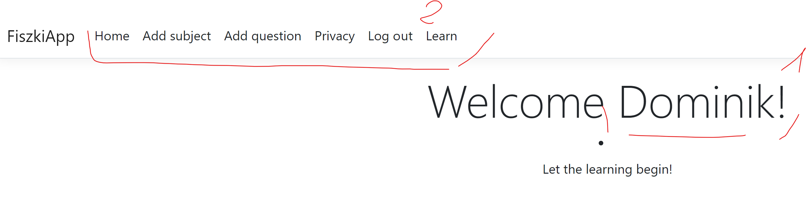

# FiszkiApp

## Spis treści
----

1. [Spis treści](#spis-treści)
2. [Opis projektu](#opis)
3. [Sposób użycia](#dodatkowe-informacje)
4. [Funkcjonalności](#funkcjonalności)
	-	[Logowanie](#logowanie)
		-	[Administracja](#administracja)
		-	[Zwykły użytkownik](#zwykły-użytkownik)
	-	[Dodawanie fiszek](#dodawanie-fiszek)
		-	[Dodawanie po jednym pytaniu](#dodawanie-po-jednym-pytaniu)
		-	[Dodawanie poprzez wysłanie pliku](#dodawanie-poprzez-wysłanie-pliku)
	-	[Dodawanie tematów](#dodawanie-fiszek)
	-	[Nakua](#dodawanie-fiszek)
	-	[Zbieranie statystyk](#dodawanie-fiszek)
5. [Dodatkowe informacje](#dodatkowe-informacje)
6. [Autorzy](#autorzy)

## Opis
----

-	Aplikacja webowa do nauki fiszek. Strona pomaga również śledzić swoje postępy poprzez podgląd swoich statystyk.

-	Zbudowana przy użyciu:
	-	**frameworku** ASP.NET Core MVC
	-	**bazy danych** SQLite.

## Sposoby użycia
----
1.	Wejdź w główny folder z kodem.
```bash
cd ./FiszkiApp
```
2.	Uruchom aplikację komendą.
```bash
dotnet run
```
3.	Zignoruj dużą ilość ostrzeżeń kompilatora.
4.	Przejdź do strony aplikacji. Wpisz w wyszukiwarkę lub poprzez konsolę kliknij w odpowiedni link.
```url
http://localhost:5273
```
5.	Następnie aplikacja przekieruje cię do strony logowania.
6.	Wypełnij dane logowania. Po zalogowaniu na jedno z kont będziesz mógł przelogować się na inne.
	-	Aby uzyskać dostęp do konta administratora podaj następujące dane:
		```json
		{
			"name"		:	"admin",
			"password"	:	"admin"
		}
		```
	-	Aby uzyskać dostęp do konta zwykłego użytkownika podaj następujące dane:
		```json
		{
			"name"		:	"asd",
			"password"	:	"asd"
		}
		```
7.	Przejrzyj funkcjonalności. Ich szczegółowe opisy znajdują się poniżej.



8.	Ekran startowy jest podzielony na 2 części:
	1.	Nazwa zalogowanego użytkownika.
	2.	Dostęp i możliwości aplikacji.

## Funkcjonalności
----
### Logowanie
-	Aplikacja daje możliwość zalogowania się na konta lub też tworzenia nowych.
-	*Hasło* w bazie danych jest przechowywane w formie skrótu **md5**.

#### Administracja
-	Jest tylko jeden użytkownik na sztywno tworzony przy pierwszym uruchomieniu aplikacji.
-	Dane do jego logowania są podane w poprzednim punkcie.
-	**Możliwości**:
	-	Tworzenie nowych użytkowników. Musi podać ich dane do logowania, które potem są dodawane odpowiednio do bazy danych.
	-	Wylogowanie się.

#### Zwykły użytkownik
-	Dozwolona jest dowolna ilość użytkowników. Konto z takim dostępem może tylko być stworzone przez *administratora* - patrz punkt poprzedni.
-	Dane do logowania na jedno konto tworzone na sztywno i są podane w poprzednim punkcie.
-	**Możliwości**:
	-	Dodanie tematów fiszek.
	-	Dodanie fiszek.
	-	Odpytywanie się z przebiegu uczenia.
	-	Sprawdzanie swoich postępów.
	-	Wylogowanie się.

### Dodawanie fiszek
-	Fiszki do nauki można dodać na dwa sposoby.
-	Po próbie dodania na dole strony wyświetli się informacja czy operacja się powiodła.

#### Dodawanie po jednym pytaniu
-	Można dodawać po jednym pytaniu poprzez interfejs webowy wpisując bezpośrednio do bazy pytania.

#### Dodawanie poprzez wysłanie pliku
-	Z kolei klikając opcję upload można dać plik **.csv** o następującym formacie i dodać bądź ile pytań naraz.
```csv
pytanie;poprawna_odpowiedź;temat_jaki_pytanie_dotyczy;identyfikator_porcji
```
-	Jeżeli plik nie ma odpowiedniego formatu to program poinformuje o nieprawidłowości.
-	Przekazany plik jest pobierany wewnątrz aplikacji od użytkownika.

### Dodawanie tematów fiszek
-	Po wypełnieniu pól, odpowiedni rekord jest tworzony w bazie danych.

### Uczenie
-	Użytkownik najpierw zostanie poproszony o podanie, czy chce uczyć się względem porcji (względem plików, które podał), czy względem własnych stworzonych tematów. Możliwe opcje wyświetlają się na ekranie
-	Po wybraniu jednej z opcji użytkownik widzi pytanie oraz ma ukazane przyciski sterujące.
	-	**Show Awnser** - Ukazuje odpowiedź do pytania.
	-	**Next Question** - Zwraca pytanie z powrotem do puli.
	-	**Skip Question** - Usuwa pytanie z puli
-	Nauka toczy się do momentu, aż nie skończą się pytania.

### Sprawdzanie statystyk


## Dodatkowe informacje
----

-	Szczególowe informacje dotyczące jak wyglądają tabele w bazie danych **(SQLite)** znajdują się w folderze:

	```bash
	cd .\Docs\database
	```

-	W przypadku wszelkich nie prawidłowości prośba jest aby zgłosić je do jednego z autorów.

# Autorzy

1.	Dominik Breksa - `dominikbreksa@student.agh.edu.pl` - [\[Link do githuba\]](https://github.com/ForNeus57)
2.	Szymon Jurecki - [\[Link do githuba\]](https://github.com/CaIiguIa)
